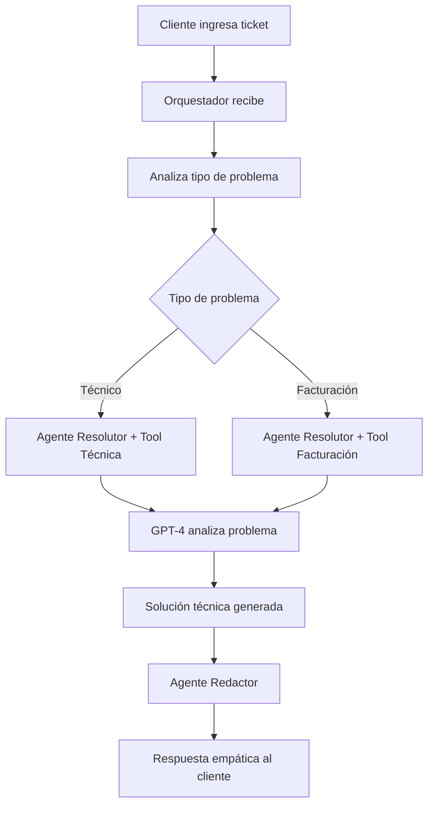

# 🤖 Google ADK Agents - Sistema de Soporte al Cliente

Sistema experimental de soporte automatizado construido con **Google ADK** que implementa un patrón de múltiples agentes especializados para resolver tickets de clientes de manera inteligente.

## 🏗️ Arquitectura

**Patrón:** Orquestador + Sub-agentes + Herramientas Externas + Human-in-the-Loop (HITL)  
**Tecnologías:** Python 3.11+, Google ADK, FastAPI, OpenAI GPT-4, Gemini 2.5 Flash

### 🎯 Flujo del Sistema



## 📂 Estructura del Proyecto

```
google-adk-agents-poc/
│
├── agents/                     # 🤖 Agentes especializados
│   ├── __init__.py
│   ├── agente_resolutor.py     # Resuelve problemas técnicos/facturación  
│   ├── agente_redactor.py      # Redacta respuestas empáticas
│   └── orquestador.py         # Coordina el flujo completo
│
├── tools/                      # 🔧 Herramientas invocables
│   ├── __init__.py
│   ├── llamar_gpt4.py         # Adaptador HTTP a GPT-4
│   ├── resolver_problema_tecnico.py
│   └── resolver_problema_facturacion.py
│
├── workflows/                  # 📋 Flujos de trabajo
│   ├── __init__.py
│   └── flujo_soporte.py       # Flujo principal del sistema
│
├── config/                     # ⚙️ Configuraciones
│   ├── __init__.py
│   └── settings.py            # Variables globales y servicios
│
├── server.py                   # 🌐 Proxy FastAPI para OpenAI
├── main.py                    # 💻 CLI interactivo
├── requirements.txt           # 📦 Dependencias
├── .env                       # 🔐 Variables de entorno
└── README.md
```

## 🚀 Inicio Rápido

### 1. Configuración del Entorno

```bash
# Clonar el repositorio
git clone <repo-url>
cd google-adk-agents-poc

# Crear entorno virtual
python -m venv venv
source venv/bin/activate  # Unix/Mac
# o
venv\Scripts\activate     # Windows

# Instalar dependencias
pip install -r requirements.txt
```

### 2. Variables de Entorno

Crear archivo `.env` en la raíz:

```env
# Configuración del servidor
PORT=8001

# API Keys
OPENAI_API_KEY=sk-xxxxxxxxxxxxxx

# Configuración de desarrollo (opcional)
ADAPTER_SERVER_URL=http://127.0.0.1:8001
```

### 3. Ejecutar el Sistema

**Opción A: Modo Interactivo (CLI)**
```bash
python main.py
```

**Opción B: Servidor HTTP + CLI en paralelo**
```bash
# Terminal 1: Servidor proxy GPT-4
python server.py

# Terminal 2: CLI del sistema
python main.py
```

## 🧠 Componentes del Sistema

### 🎯 Agentes Principales

| Agente | Modelo | Función |
|--------|--------|---------|
| **Orquestador** | Gemini 2.5 Flash | Coordina el flujo, distribuye tareas |
| **Agente Resolutor** | Gemini 2.5 Flash | Analiza problemas, invoca herramientas |
| **Agente Redactor** | Gemini 2.5 Flash | Redacta respuestas empáticas |

### 🔧 Herramientas Disponibles

- **`resolver_problema_tecnico`**: Consulta GPT-4 para problemas técnicos
- **`resolver_problema_facturacion`**: Consulta GPT-4 para problemas de facturación
- **`llamar_gpt4`**: Adaptador HTTP hacia OpenAI API

### 📋 Flujos de Trabajo

- **`ejecutar_flujo_soporte`**: Flujo principal que coordina todos los agentes

## 💡 Ejemplo de Uso

```python
import asyncio
from workflows.flujo_soporte import ejecutar_flujo_soporte

# Ejemplo de ticket
ticket = "Mi aplicación web no carga desde ayer. Error 500 en el servidor."

# Ejecutar el flujo
resultado = await ejecutar_flujo_soporte(ticket)
print(resultado)
```

**Salida esperada:**
```
Estimado cliente,

Hemos identificado que el error 500 en su aplicación web se debe a...
[respuesta técnica detallada y empática]
```

## 🛠️ Configuración Avanzada

### Modelos de IA Configurables

En [`agents/orquestador.py`](agents/orquestador.py):
```python
orquestador = LlmAgent(
    name="Orquestador",
    model="gemini-2.5-flash",  # Cambiar modelo aquí
    # ...
)
```

### URLs de Desarrollo vs Producción

El sistema auto-detecta el entorno:
- **Desarrollo local**: `http://127.0.0.1:8001`
- **Producción**: `http://localhost:8001` (contenedor)

## 🧪 Testing y Debugging

### Logs del Sistema
El sistema muestra previews de las respuestas de cada agente:
```
💬 [AgenteResolutor]: Analizando problema técnico... (+847 chars)
💬 [AgenteRedactor]: Estimado cliente, hemos identificado... (+432 chars)
```

### Casos de Prueba Recomendados

```python
# Problema técnico
ticket_1 = "Error 404 en mi sitio web"

# Problema de facturación  
ticket_2 = "No puedo pagar mi factura con tarjeta de crédito"

# Problema mixto
ticket_3 = "Mi cuenta está suspendida y no sé por qué"
```

## 📋 Dependencias Principales

```txt
google-adk        # Framework de agentes de Google
openai           # API de OpenAI para GPT-4
fastapi          # Servidor HTTP para proxy
uvicorn          # Servidor ASGI
python-dotenv    # Manejo de variables de entorno
httpx            # Cliente HTTP asíncrono
```

## 🔧 Troubleshooting

### Error: `ModuleNotFoundError: No module named 'llamar_gpt4'`
**Solución:** Verifica que todos los directorios tengan archivos `__init__.py`

### Error: `ModuleNotFoundError: No module named 'dotenv'`
**Solución:** Instala las dependencias con `pip install -r requirements.txt`

### El servidor no responde en puerto 8001
**Solución:** Verifica que el puerto no esté ocupado o cambia `PORT` en `.env`

## 🚀 Próximos Pasos

- [ ] Agregar más herramientas especializadas
- [ ] Implementar persistencia con base de datos  
- [ ] Interfaz web con React/Vue
- [ ] Métricas y analytics de conversaciones
- [ ] Integración con sistemas de tickets reales

## 📝 Licencia

Ver archivo [LICENSE](LICENSE) para más detalles.

## 🤝 Contribuciones

1. Fork el proyecto
2. Crea una rama (`git checkout -b feature/nueva-funcionalidad`)
3. Commit tus cambios (`git commit -m 'Agregar nueva funcionalidad'`)
4. Push a la rama (`git push origin feature/nueva-funcionalidad`)
5. Abrir Pull Request